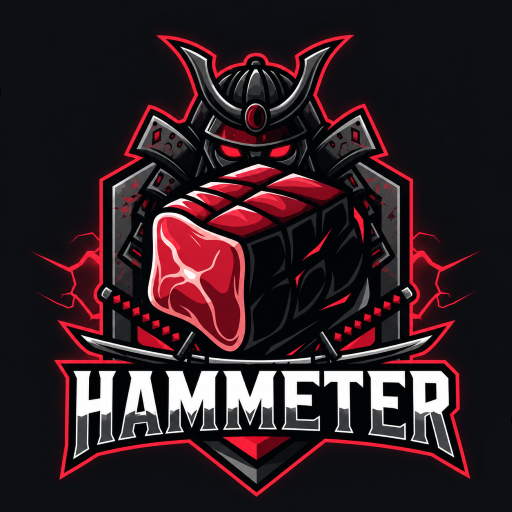
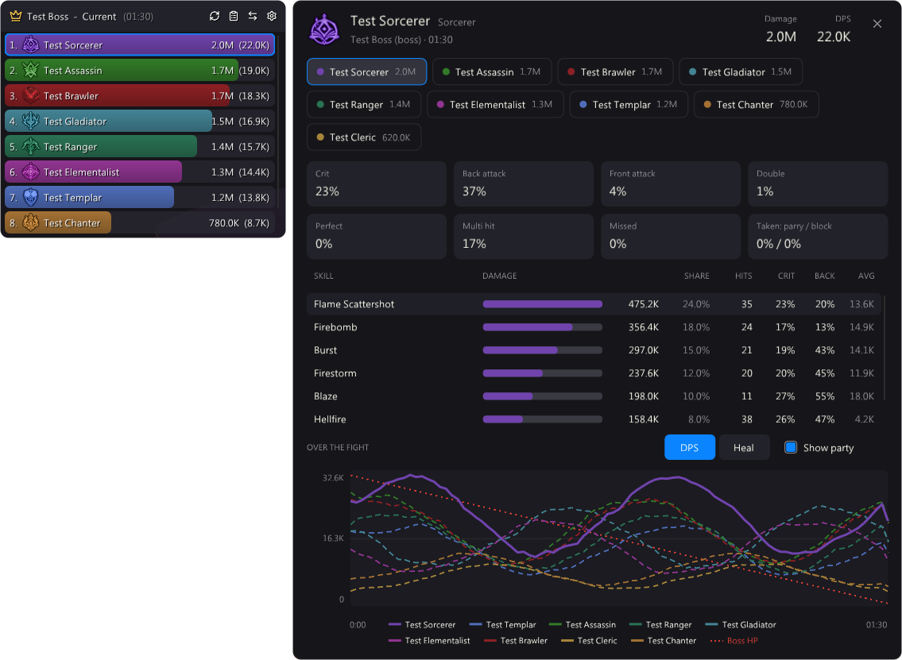
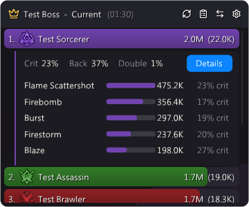

<div align="center">



# HamMeter for Aion 2

**A clean, easy-to-read damage meter for Aion 2, shown as an overlay on top of the game.**

[](https://github.com/NennMichSchinken/HamMeter-Aion2/releases/latest)
[](#requirements)
[](LICENSE)



</div>

## Why HamMeter

- **Matches the game.** Damage, crit, back attack, front attack, double, perfect and multi hit match the in-game damage analyzer exactly, total and per skill, checked boss by boss.
- **Made for groups.** You and your party only, never players who are merely nearby. Damage, damage taken, healing, healing taken and deaths, for every boss and every pack.
- **Skill details.** Click a bar for the top skills, or open *Details* for every skill, the hit rates and a chart of the fight with your party and the boss's HP.
- **Fights like in WoW.** Every pack is its own fight and walking between packs never lowers your DPS. Bosses get a fight of their own with a crown. *Overall* sums up the boss fights.
- **Safe by design.** HamMeter only reads the game's network traffic. It never touches the game's memory, injects nothing and sends nothing anywhere. [More below](#security).



### Also

- Updates itself, with signed updates
- Every dungeon run starts with an empty meter
- Skill names in English or German
- Class icons, class or role colours, nine bar styles
- Works with VPNs and ping boosters such as LagoFast
- Sits in the tray, no taskbar button
- Test mode to try every setting without a fight

<br clear="right">

## Get started

1. **Download** `HamMeter-Setup-<version>.exe` from the [latest release](https://github.com/NennMichSchinken/HamMeter-Aion2/releases/latest) and run it.
2. **Pick "With Npcap"** in the setup (recommended). The setup installs it for you and checks it.
3. **Set Aion 2 to borderless windowed** and play. The meter shows up with your first fight.

Updates are offered inside HamMeter. Uninstall from *Apps & Features*; nothing stays behind.

### Requirements

- Windows 10 or 11 (64-bit)
- Aion 2 in **borderless windowed** mode (no overlay can draw over exclusive fullscreen)
- [Npcap](https://npcap.com/#download), installed by the setup. Without Npcap, HamMeter needs administrator rights on every start and VPNs or ping boosters don't work.

## Contact

Questions, ideas or a bug? Write me on **Discord: `nennmichschinken`**, or open an [issue](https://github.com/NennMichSchinken/HamMeter-Aion2/issues).

If numbers look wrong: in *Settings → Data & App* turn on **Record packets**, play the fight, quit HamMeter from the tray and send me the screenshot of the game's damage analyzer and the recording from `%APPDATA%\HamMeter-Aion2\PacketLogs`. Recordings are encrypted and can only be opened on your PC, so send them only when asked.

## Security

HamMeter touches as little as it can:

- **Read-only.** It reads the network packets of `Aion2.exe`'s own connections and drops everything else. No game memory, no code injection, nothing sent to the game.
- **No data leaves your PC.** The only connection HamMeter makes is the update check to GitHub on start, and you can turn it off.
- **Signed updates.** *Update now* only runs a setup signed with the author's key, so a hijacked GitHub account alone cannot ship code to you.
- **No admin rights** with Npcap. Nothing is stored except your settings; fights live in memory and are gone when HamMeter closes.

<details>
<summary><b>The full security model</b></summary>

- **Minimal network access.** HamMeter opens no listening port. Its only outgoing connection is the update check: one HTTPS request to the GitHub API on start (can be turned off in the setup and in Settings → Data & App).
- **Signed updates.** "Update now" only runs a downloaded setup whose ECDSA-P256 signature matches the public key built into HamMeter (`HamMeter.Aion2/Update/release-public-key.txt`). The private key never leaves the author's PC. Downloads are HTTPS-only, GitHub hosts only, size-capped, and locked between verification and start.
- **Least privilege.** With Npcap, HamMeter runs as a normal user. Only without Npcap does it restart with administrator rights (UAC prompt), because Windows raw sockets require them.
- **Narrow capture.** A packet is only looked at if it belongs exactly to a TCP connection owned by `Aion2.exe`; everything else is dropped after the header checks. With Npcap, only the adapter that carries the game connection is opened, not in promiscuous mode, with a kernel filter for the game's servers. Raw sockets don't switch the network card to promiscuous mode either (`RCVALL_IPLEVEL`). All lengths are bounds-checked, fragments are dropped, and a connection is only used after Aion's keep-alive was seen on it.
- **Safe unpacking.** Compressed bundles are size- and depth-limited, so a malformed packet cannot exhaust memory.
- **Data minimisation.** No database: fight history lives in memory. Logs contain no packet contents. `config.json` holds only look-and-feel settings.
- **Encrypted recordings.** The optional packet recording is AES-256-GCM encrypted, with the key protected by Windows DPAPI for your Windows account only. It is off on every start, and recordings are deleted after 7 days.
- **Memory-safe parsing.** All packet parsing is managed C# with bounds-checked readers.

</details>

## For developers

<details>
<summary><b>How it works</b></summary>

HamMeter reads the game's network packets passively, through Npcap or Windows raw sockets.

- **Protocol** (`docs/protocol.md`): the Aion 2 traffic (framing, compressed bundles, combat, entity and party packets) with the status of every part: confirmed, observed or open. All reading code is written from it.
- **Capture** (`HamMeter.Aion2/Capture`): finds `Aion2.exe`'s connections and reads only those; TCP reassembly in order.
- **Packets** (`HamMeter.Aion2/Protocol`): cuts the stream into game packets, unpacks LZ4 bundles, routes by opcode.
- **Game** (`HamMeter.Aion2/Game`): who is who (you, your party, summons and their owners), what skill codes mean, the monster list for names and bosses.
- **Fights** (`HamMeter.Aion2/Combat`): damage, damage taken, healing, deaths and the skill details, per fight.
- **Overlay** (`HamMeter.Aion2/UI`): ImGui on [ClickableTransparentOverlay](https://github.com/zaafar/ClickableTransparentOverlay), ported from [HamMeter for FFXIV](https://github.com/NennMichSchinken/HamMeter).

</details>

<details>
<summary><b>Building and testing</b></summary>

```bash
dotnet build HamMeter.Aion2.slnx
dotnet test HamMeter.Aion2.slnx
dotnet run --project HamMeter.Aion2 -c Release
```

Test mode with the skill details open (also used for the pictures above):

```bash
dotnet run --project HamMeter.Aion2 -c Release -- --preview --preview-test 2
```

After a game patch: turn on *Record packets*, play a few fights, quit HamMeter, then `HamMeter.exe --replay <file.hmrec>` writes `<file>.report.txt` with every fight, per-skill totals and the opcodes seen. Compare with the game's damage analyzer, fix what changed and update `docs/protocol.md`. New monsters go into `HamMeter.Aion2/Game/Data/npcs.json` (see `Game/Data/SOURCE.md`).

</details>

<details>
<summary><b>Releasing</b></summary>

1. Add the patch notes to `CHANGELOG.md` (`## <version> - <yyyy-mm-dd>`, lines `- New:` / `- Improved:` / `- Fixed:`; `[important]` on the heading for releases users should not skip).
2. Set `<Version>` in `HamMeter.Aion2/HamMeter.Aion2.csproj`, then run `.\build\build.ps1 -Version <version>` (needs [Inno Setup 6](https://jrsoftware.org/isdl.php)).
3. Sign on the author's Windows account: `dotnet run --project build\ReleaseSigner -c Release -- sign artifacts\HamMeter-Setup-<version>.exe`.
4. Create the GitHub release `v<version>` with `release-notes-<version>.md` as the text and upload the setup and its `.sig`. HamMeter only offers releases that have both.

The release key lives DPAPI-protected in `%APPDATA%\HamMeter-ReleaseKey`. Losing it means installed copies can no longer update themselves.

</details>

## Credits

Concept, design and UX/UI by **NennMichSchinken**. The code was written with the help of AI (Claude) under my direction.

- Monster list and skill names: compiled by **taengu** (GPL-3.0), see `HamMeter.Aion2/Game/Data/SOURCE.md`
- Class icons: official AION 2 artwork by **NCSoft**
- Bar textures and styles: **WispUI** (NennMichSchinken, MIT)
- Icons: [Lucide](https://lucide.dev) (ISC)
- [SharpPcap](https://github.com/dotpcap/sharppcap) (MIT), [K4os.Compression.LZ4](https://github.com/MiloszKrajewski/K4os.Compression.LZ4) (MIT), [Inno Setup](https://jrsoftware.org/isinfo.php) by Jordan Russell and Martijn Laan

Aion 2 is a trademark of NCSoft. HamMeter is a fan project and not affiliated with NCSoft.

## License

GPL-3.0, see [LICENSE](LICENSE). (HamMeter for FFXIV stays MIT.)
